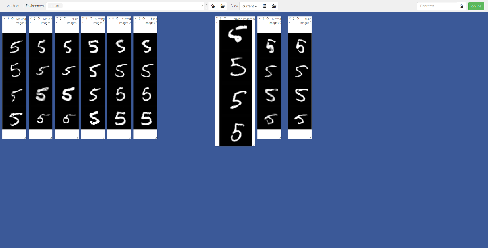
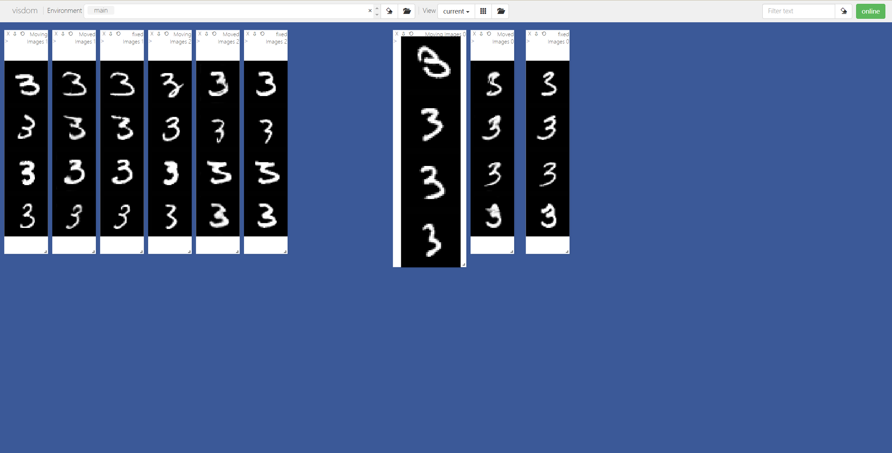
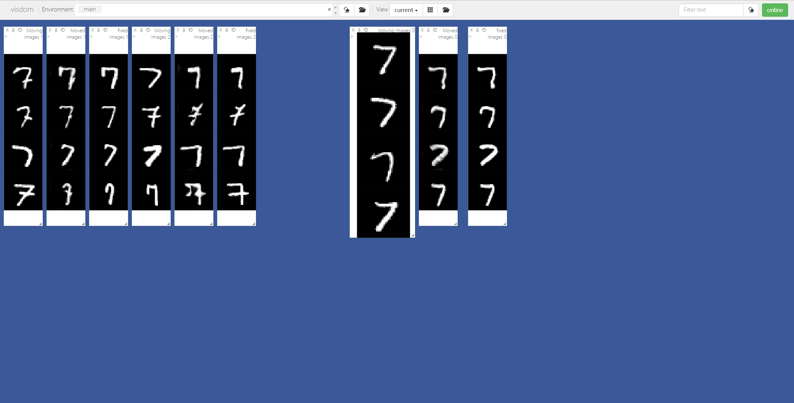

# registration-in-action

动手学深度学习图像配准（DLIR），基于 [VoxelMorph](https://github.com/voxelmorph/voxelmorph) 。

推荐 DLIR 入门教程：

- https://www.kaggle.com/code/adalca/learn2reg/notebook
- [DeepReg Intro to DLIR](https://github.com/DeepRegNet/DeepReg/blob/main/docs/Intro_to_Medical_Image_Registration.ipynb)
- [Deep learning and medical imaging](https://theaisummer.com/medical-image-deep-learning/)

## 2D 配准

### 数据集

MNIST

### 训练

> **train_vm_2d.py**

本地运行：

- 启动 visdom 用于实时可视化

```shell
python -m visdom.server
```

- 启动训练

```shell
python train_vm_2d.py \
    -output output/mnist/ \
    -is_visdom True \
    -choose_label 5 \
    -val_interval 1 \
    -save_interval 50
```

数字 5 的预训练结果见 `ckpts/mnist`


### 预测

> **register_vm_2d.py**

本地运行：

```shell
python register_vm_2d.py \
    -output output/mnist_test/ \
    -model output/mnist/reg_net_299.pth \
    -is_visdom True \
    -choose_label 5 \
```

预测结果可视化：



模型神奇地显示出了泛化效果，在没有参与训练的数字 3 上也可以配准， 其它数字也一样：





## 3D 配准

### 数据集

[LPBA40](https://github.com/AIforMS/seg-with-ti/releases/tag/v0.1.2) - 3D 脑部 MRI

### 训练

> **train_vm_3d.py**

训练脚本：

```shell
#!/bin/bash
#SBATCH -J LPBA
#SBATCH -p gpu1
#SBATCH -N 1
#SBATCH -n 1
#SBATCH --gres=gpu:1
#SBATCH -o logs/trainOutLPBA.txt
#SBATCH -e logs/trainErrLPBA.txt

SLURM_SUBMIT_DIR=/public/home/jd_shb/fromgithub/registration-in-action
cd $SLURM_SUBMIT_DIR
NP=$SLURM_JOB_GPUS

CUDA_VISIBLE_DEVICES=$NP python train_vm_3d.py \
    -dataset lpba40 \
    -output output/lpba/ \
    -resume /public/home/jd_shb/fromgithub/registration-in-action/output/lpba/lpba40_best71.pth \
    -batch_size 2 \
    -lr 1e-4 \
    -apply_lr_scheduler \
    -epochs 800 \
    -weakly_sup \  # 使用分割标签辅助训练
    -sim_loss MSE \
    -sim_weight 1.0 \
    -dice_weight 0.1 \
    -img_folder /public/home/jd_shb/fromgithub/multimodal/OBELISK_V02/preprocess/datasets/LPBA40/train \
    -label_folder /public/home/jd_shb/fromgithub/multimodal/OBELISK_V02/preprocess/datasets/LPBA40/label \
    -train_scannumbers "11 12 13 14 15 16 17 18 19 20 21 22 23 24 25 26 27 28 29 30 31 32 33 34 35 36 37 38 39 40" \
    -val_scannumbers "1 2 3" \
    -img_name S?.delineation.skullstripped.nii.gz \
    -label_name S?.delineation.structure.label.nii.gz
```

### 预测

> **register_vm_3d.py**

运行：

```shell
python register_vm_3d.py \
    -output output/lpba_test/ \
    -model output/lpba/lpba40_best71.pth \
    -img_folder /public/home/jd_shb/fromgithub/multimodal/OBELISK_V02/preprocess/datasets/LPBA40/train \
    -label_folder /public/home/jd_shb/fromgithub/multimodal/OBELISK_V02/preprocess/datasets/LPBA40/label \
    -fix_number "5" \
    -mov_numbers "4 6 7 8 9 10" \
    -img_name S?.delineation.skullstripped.nii.gz \
    -label_name S?.delineation.structure.label.nii.gz
```

会保存 moved image、moved label、flow field，评估指标保存在 test.log。
