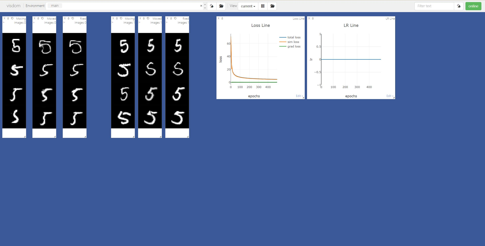

# registration-in-action

动手学深度学习图像配准（DLIR）

## 2D 配准

### 数据集

MNIST

### 训练

> **train_vm_2d.py**

本地运行：

- 启动 visdom 用于实时可视化

```shell
python -m visdom.server
```

- 启动训练

```shell
python train_vm_2d.py \
    -output output/mnist/ \
    -is_visdom True \
    -choose_label 5 \
    -val_interval 1 \
    -save_interval 50
```

数字 5 的预训练结果见 `ckpts/mnist`



### 预测

> **register_vm_2d.py**

本地运行：

```shell
python register_vm_2d.py \
    -output output/mnist_test/ \
    -model output/mnist/reg_net_299.pth \
    -is_visdom True \
    -choose_label 5 \
```

预测结果可视化：


模型神奇地显示出了泛化效果，在没有参与训练的数字 3 上也可以配准， 其它数字也一样：


## 3D 配准

### 数据集

LPBA40 - 3D 脑部 MRI

### 训练


### 预测
